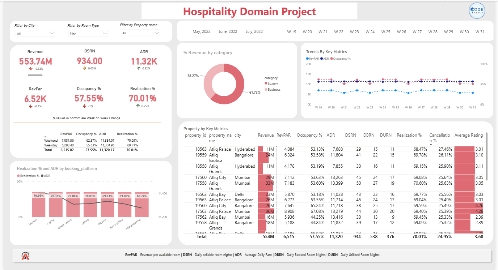
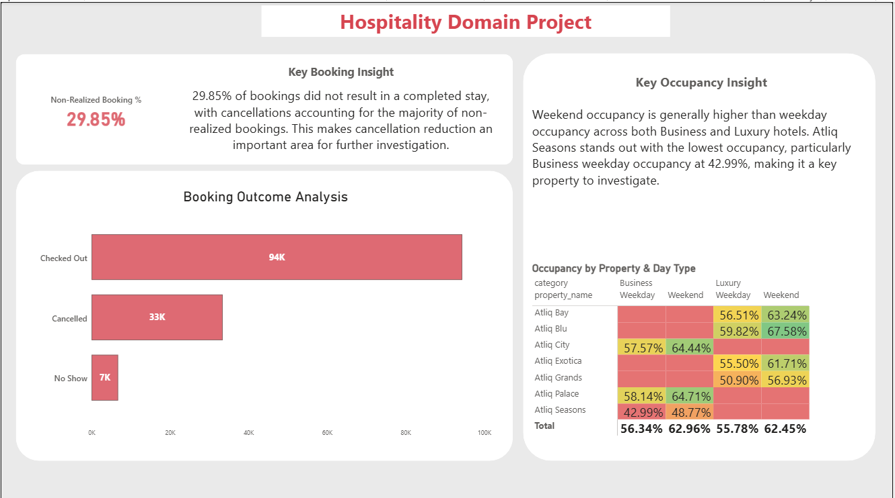
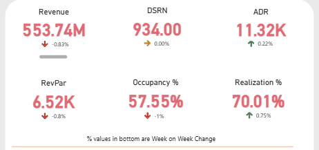
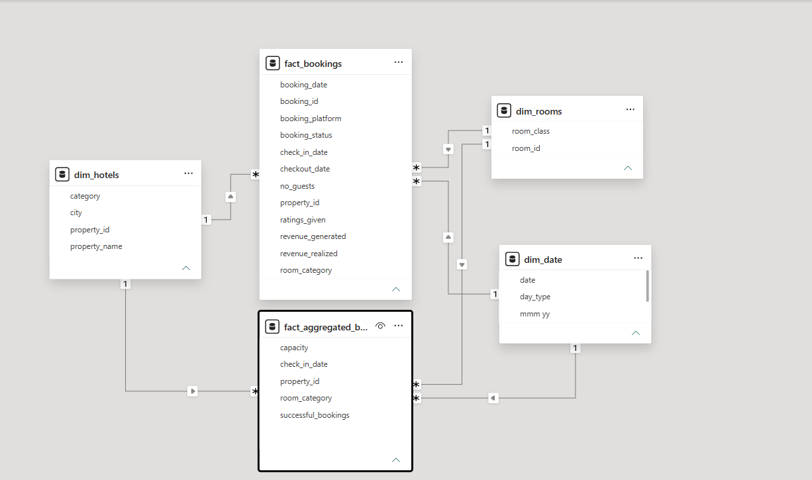

# 🏨 Hospitality Revenue & Performance Analysis – Power BI

## 📌 Project Overview

An interactive Power BI dashboard developed to analyze hotel revenue,
booking performance, occupancy, pricing, and operational metrics.

The project focuses on transforming hotel booking data into meaningful
KPIs and business insights that can support performance analysis and
further business investigation.

---

## 🎯 Business Objective

The objective of this project is to analyze hotel performance and answer
key business questions such as:

- How is revenue performing over time?
- Which hotel category generates stronger revenue?
- What is the occupancy trend?
- How are ADR and RevPAR performing?
- What is the impact of cancellations and no-shows?
- How do different booking platforms contribute to bookings?

---

## 📊 Key KPIs

| KPI | Description |
|---|---|
| Revenue | Total revenue generated |
| Occupancy % | Percentage of available rooms occupied |
| ADR | Average Daily Rate |
| RevPAR | Revenue per Available Room |
| Realisation % | Percentage of bookings converted into realized revenue |
| Cancellation % | Percentage of bookings cancelled |
| DSRN | Daily Sellable Room Nights |

---

## 🖥️ Dashboard

### Dashboard 1

### Dashboard 2

### KPI Overview

---

## 🧩 Data Model

The dashboard uses a structured Power BI data model to connect
booking, hotel, and date-related information.

---

## 🔍 Key Business Insights

- Revenue showed a gradual increase during the analyzed period.
- Luxury hotels showed stronger revenue performance compared with
  business hotels.
- ADR remained relatively stable during the period.
- Weekday occupancy, particularly for business hotels, requires
  further investigation.
- Cancellation and no-show patterns may be affecting room utilisation.
- Booking platform performance can be analyzed to understand differences
  in booking and cancellation behavior.

Detailed analysis is available in
[`Business Insights`](Insights/Business-Insights.md).

---

## 🛠️ Tools & Skills

- **Power BI**
- **DAX**
- **Power Query**
- **Data Modeling**
- **Data Visualization**
- **KPI Analysis**
- **Business Analysis**

---

## 📈 Analysis Areas

- Revenue Performance
- Hotel Category Performance
- Occupancy Analysis
- ADR & RevPAR
- Booking Platform Analysis
- Cancellation Analysis
- Week-on-Week Performance

---

## 💡 Key Learning

This project helped me strengthen my ability to move beyond dashboard
creation and use data to identify trends, compare performance, and
formulate questions for further business investigation.